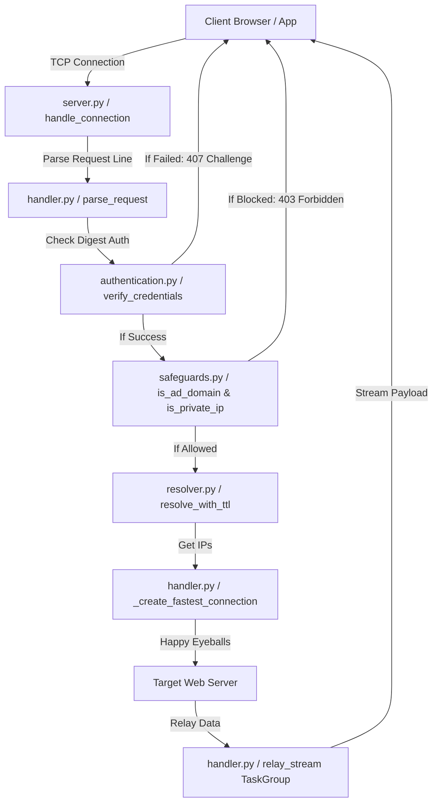

# System Architecture Overview

[⬅️ Back to Architecture Index](index.md)

Wormhole is designed around an asynchronous, non-blocking I/O model using Python's `asyncio` event loop.

## Module Breakdown

| Module | Core Responsibility |
|---|---|
| [`proxy.py`](../../wormhole/proxy.py) | Application entrypoint, CLI parsing, event loop selection (`uvloop`/`winloop`/[Talyn](https://github.com/cwt/talyn)), signal handling. |
| [`server.py`](../../wormhole/server.py) | Socket binding, dual-stack initialization, connection task lifecycle management. |
| [`handler.py`](../../wormhole/handler.py) | Protocol parsing, HTTPS tunnel routing, HTTP header rewriting, stream relaying, Happy Eyeballs. |
| [`context.py`](../../wormhole/context.py) | `RequestContext` object carrying request metadata, client IP, verbosity, and timing. |
| [`resolver.py`](../../wormhole/resolver.py) | Singleton DNS resolver combining `aiodns` async lookups with local `/etc/hosts` caching. |
| [`safeguards.py`](../../wormhole/safeguards.py) | SSRF private IP validation, in-memory domain block/allow set matching, public IPv6 detection. |
| [`ad_blocker.py`](../../wormhole/ad_blocker.py) | Asynchronous blocklist downloader, domain parser, subdomain filter, and SQLite DB builder. |
| [`authentication.py`](../../wormhole/authentication.py) | HTTP Digest SHA-256 challenge generation and header verification. |
| [`auth_manager.py`](../../wormhole/auth_manager.py) | Synchronous user management CLI commands (`add`, `modify`, `delete`) with secure file permissions. |
| [`network_monitor.py`](../../wormhole/network_monitor.py) | Background monitoring task detecting IPv6 interface availability for server auto-restart. |
| [`logger.py`](../../wormhole/logger.py) | Loguru setup, console/syslog sinks, log throttling and formatters. |
| [`tools.py`](../../wormhole/tools.py) | Regex helper routines for Host header parsing and Content-Length extraction. |

## Request Lifecycle Flow

