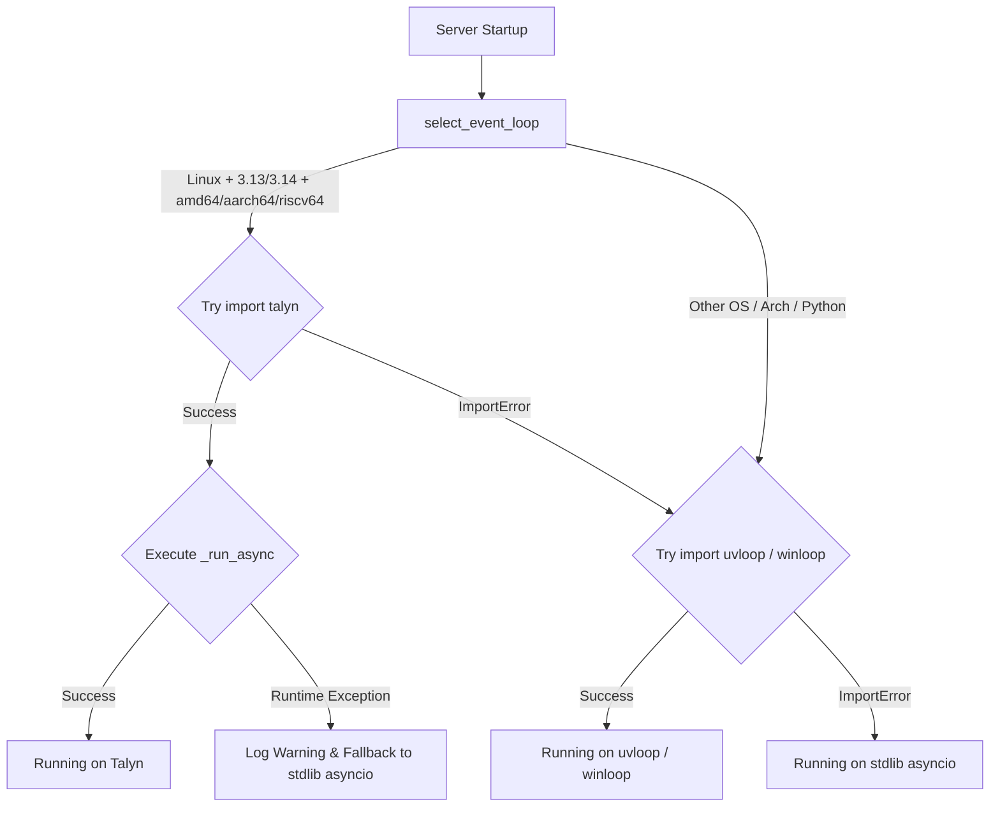

# Experimental Talyn Event Loop Integration

[⬅️ Back to Development Index](index.md)

Wormhole includes experimental dogfooding support for **[Talyn](https://github.com/cwt/talyn)**, a next-generation high-performance `asyncio` event loop implementation.

Unlike `uvloop` (which is the production-ready standard default for the `performance` extra), **Talyn is currently in active development** and targeted at modern Linux environments.

---

## Target Platforms & Compatibility

Talyn selection is automatically gated in [`wormhole/proxy.py`](../../wormhole/proxy.py) by `select_event_loop()`. It will only be attempted when **all** of the following runtime constraints are satisfied:

| Constraint | Allowed Values |
|---|---|
| **Operating System** | `Linux` (`sys.platform == 'linux'`) |
| **CPU Architecture** | `x86_64` (amd64), `aarch64` (arm64), `riscv64` (RISC-V 64) |
| **CPython Version** | CPython `3.13` or `3.14` |

On any other platform, architecture, or Python version, Wormhole skips Talyn and uses `uvloop` (on Linux/macOS) or `winloop` (on Windows).

---

## Installation for Developers

Talyn is kept separate from the default `performance` extra to prevent exposing production users to experimental C-extension builds.

Developers and dogfood testers can install Talyn explicitly:

### Using Poetry

```bash
poetry install --extras talyn
```

### Using Pip / Editable Mode

```bash
pip install -e .[talyn]
```

---

## Runtime Selection & Automatic Fallback

To prevent application crashes if Talyn fails during initialization or runtime setup, Wormhole employs a dual-stage safety net:



### 1. Selection Phase (`select_event_loop`)
When `import talyn` succeeds, `fastloop` is assigned to `talyn`. If `import talyn` fails with `ImportError`, selection automatically falls back to `uvloop`.

### 2. Runtime Fallback Phase (`_run_async`)
If Talyn is imported but fails during event loop policy installation or loop execution (before `wrap_coro()` begins), `_run_async` catches the exception, logs a warning:
```text
Optimized event loop talyn unavailable; using standard asyncio.
```
and seamlessly falls back to standard `asyncio` without aborting proxy startup.

---

## Comparison: `uvloop` vs `Talyn`

| Attribute | `uvloop` | `Talyn` |
|---|---|---|
| **Status** | Production Stable | Experimental (Dogfooding) |
| **Install Option** | `--extras performance` (Default) | `--extras talyn` (Opt-in) |
| **Platforms** | Linux, macOS, FreeBSD | Linux only |
| **Architectures** | All supported by libuv | `x86_64`, `aarch64`, `riscv64` |
| **Python Targets** | Python 3.11+ | CPython 3.13, 3.14 |
