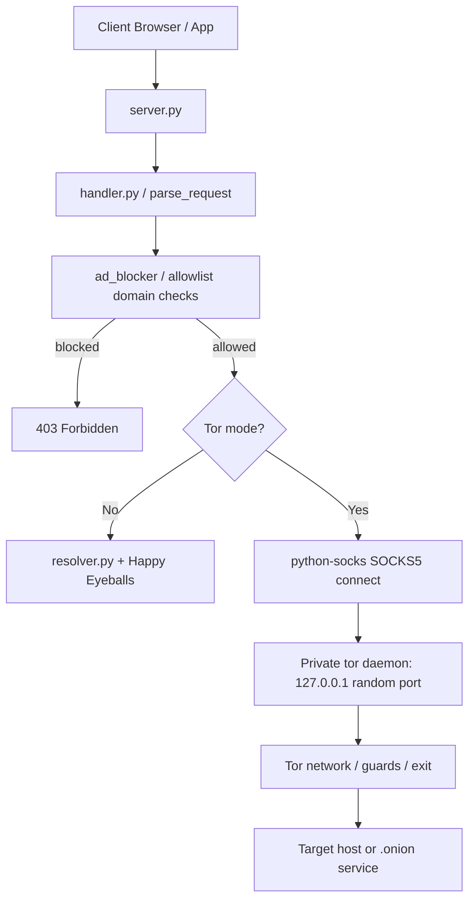

# Tor Integration Implementation Plan

[⬅️ Back to Development Index](index.md)

**Status:** Implemented in v3.6.0 — the gated integration test/CI job and the Quay.io `tor` image trigger remain.

Wormhole will gain an optional `--tor` mode that routes all outbound proxy traffic through the Tor network. The design deliberately avoids shipping or downloading binaries, never trusts pre-existing local SOCKS listeners, and degrades through a bounded bridge ladder on censored networks.

---

## 1. Objectives & Non-Goals

### Objectives

- Route outbound HTTP and HTTPS traffic through a locally spawned, Wormhole-owned `tor` daemon.
- Keep the trust boundary at *"the user installed tor via their OS package manager or Tor Browser"*.
- Never reuse an unknown listener already running on `9050`/`9150`.
- Survive censored networks through a bounded bootstrap ladder: direct → obfs4 → snowflake → webtunnel.
- Produce actionable diagnostics when Tor is completely blocked on the user's network.

### Non-Goals (v1)

- No pure-Python Tor protocol implementation (see [§12](#12-alternatives-considered)).
- No automatic download or bundling of `tor` / pluggable-transport (PT) binaries.
- No `.onion` hosting (onion service) — future work ([§11](#11-milestones)).
- No per-request circuit rotation — future work, requires a control connection.
- No fallback to a user-managed daemon on `9050`/`9150`.

---

## 2. Locked Design Decisions

| Decision | Rationale |
|---|---|
| User-installed `tor` only (`--tor-binary` / `PATH`), no downloads | Removes supply-chain risk of fetching binaries; the OS package manager remains the trust channel. |
| Spawn a private daemon on random loopback ports | A listener on `9050` has unknown provenance; a private daemon isolates `DataDirectory`, ports, and lifetime. |
| `stem` for process control, `python-socks` for transport | `stem` is pure Python and handles bootstrap detection + owning-process shutdown; `python-socks` connects raw streams and accepts an explicit timeout (aiohttp-socks' `open_connection` is deprecated and caps connects at 60 s, breaking onion rendezvous). |
| Bridge pool handed to tor, not selected by Wormhole | Tor pins a primary guard and fails over on its own; per-launch random selection weakens guard stability. |
| Re-fetch bridges only on failure, bounded (max 3 batches) | Burned bridges stay burned; rotation is a connectivity-over-stability tradeoff and must be rare. |
| No hardcoded public bridge lists | Published bridges are blocked within days; BridgeDB exists so bridges stay unenumerable. |
| No `.onion` / hidden-service support in v1 | Scope control; hostname passthrough keeps the door open. |
| Docker Tor variant is a second, self-contained Dockerfile | Quay.io triggers cannot pass `--build-arg`; see [§10](#10-docker-packaging-quayio). |

---

## 3. Trust & Threat Model

| Element | Trust | Notes |
|---|---|---|
| `tor` binary at `--tor-binary` / `PATH` | Trusted | Same trust the user already gives their OS packages. |
| BridgeDB Moat HTTPS responses | Trusted for bridge data | Bridge fingerprints prevent impersonation; bridge operators are semi-trusted (see below). |
| Unknown listeners on `9050`/`9150` | Untrusted | Never contacted. |
| Pluggable-transport binaries | Trusted | Must be user-installed (distro package or Tor Browser layout). |
| Bridge operators | Semi-trusted | See client IP and can attempt traffic confirmation; fingerprint pinning prevents MITM impersonation. |

**Considered attacker capabilities:** malicious local process (cannot read the 0700 data dir, cannot easily find random loopback ports, cannot inject bridge lines), network DPI/blocking, malicious bridge.

**Out of scope:** global passive adversary, compromised tor binary, hostile `PATH` controlled by an attacker who already has code execution.

---

## 4. CLI Surface

New `Tor Options` argument group in `wormhole/proxy.py`, matching existing argparse group style.

| Flag | Type | Default | Purpose |
|---|---|---|---|
| `--tor` | flag | off | Enable Tor mode. |
| `--tor-binary` | path | `tor` (`tor.exe` on Windows) | Explicit daemon path; skips `PATH` lookup. |
| `--tor-bridge` | str, repeatable | — | Bridge line pool; implies `--tor`. |
| `--tor-bridge-file` | path | — | File with one bridge line per non-comment line; implies `--tor`. |
| `--tor-timeout` | int seconds | `90` | Per-rung bootstrap budget. |
| `--tor-data-dir` | path | platform data dir | Persistent state root (`<dir>/<rung>` per attempt). |
| `--tor-pt-dir` | path | auto-discovered | Directory with PT binaries. |
| `--tor-no-bridges` | flag | off | Direct rung only; skip the ladder. |
| `--tor-snowflake` | flag | off | Opt in to the slow snowflake rung. |
| `--tor-isolate-dest` | flag | off | Add `IsolateDestAddr` so destinations do not share circuits. |

Default data dir: `$XDG_DATA_HOME/wormhole/tor` (Linux), `~/Library/Application Support/wormhole/tor` (macOS), `%LOCALAPPDATA%\wormhole\tor` (Windows).

**Behavior and exit codes**

| Condition | Result |
|---|---|
| `--tor-bridge` / `--tor-bridge-file` without `--tor` | Implied; no error. |
| `--tor` but no binary found / version below floor | Exit `2` with per-OS install hints (apt/dnf/pacman/brew, Tor Browser path). |
| All ladder rungs fail | Exit `3` with the blocked-network report ([§8](#8-failure-classification--reporting)). |
| `--tor` combined with `--allow-private` | Warn once: local SSRF filter is bypassed by remote resolution. |
| `--tor` plus ad-block / allowlist / auth | Fully supported; domain filters still apply. |

---

## 5. Architecture

| File | Change |
|---|---|
| `wormhole/tor.py` (new) | `TorManager` singleton, `TorConfig` dataclass, binary discovery + version check, free-port allocation, per-rung config builder, `stem` launch wrapper, PT discovery, Moat client, failure classifier, shutdown. |
| `wormhole/proxy.py` | New argument group; start manager during `main_async()`; abort with report on failure; terminate daemon on shutdown/restart. |
| `wormhole/handler.py` | Tor-aware connect path: bypass `resolve_target()` local DNS, pass hostname to SOCKS5 (remote DNS, `.onion`-ready), skip the private-IP SSRF check, keep ad-block/allowlist domain checks. |
| `pyproject.toml` | New optional `tor` extra. |
| `Dockerfile.tor` + `.dockerignore` | Self-contained Tor image variant for Quay.io build triggers; Dockerfiles kept inside the build context. |
| `docs/user-guide/tor.md` | User-facing setup guide (Milestone 3). |
| `tests/test_tor.py`, `tests/integration/test_tor_integration.py` | Unit and gated integration tests. |

### Request flow under `--tor`



### Optional dependency extra

```toml
[project.optional-dependencies]
tor = ["python-socks[asyncio]", "stem"]

[tool.poetry.dependencies]
python-socks = { version = ">=3.1,<4.0", extras = ["asyncio"], optional = true }
stem = { version = ">=1.8,<2.0", optional = true }
```

Because `dependencies` are dynamic (Poetry-generated), verify whether a `[tool.poetry.extras]` mapping is also required when implementing.

Import policy: `proxy.py` and `tor.py` must import `python_socks` / `stem` lazily so Wormhole runs unchanged without the extra installed.

---

## 6. Private Daemon Lifecycle

### Generated configuration per rung

| Key | Value | Reason |
|---|---|---|
| `SocksPort` | `127.0.0.1:<random>` | Ephemeral, loopback-only; optionally `IsolateDestAddr`. |
| `ControlPort` | `127.0.0.1:<random>` | Cookie-auth only; reserved for future circuit rotation. |
| `CookieAuthentication` | `1` | No passwords in files. |
| `DataDirectory` | `<tor-data-dir>/<rung>` | Per-rung isolation; persistent guards; 0700 on POSIX. |
| `ClientOnly` | `1` | Never relay. |
| `SafeSocks` | `1` | Warn about unsafe SOCKS usage. |
| `SocksTimeout` | `240` | Onion rendezvous can exceed tor's 120 s default; client budgets are 60 s clearnet / 250 s onion. |
| `Log` | `notice stdout` | Captured via `init_msg_handler`. |
| `UseBridges` + `Bridge` + `ClientTransportPlugin` | bridge rungs only | See [§7](#7-bridge-bootstrap-ladder). |

### Steps

1. Discover the binary (`--tor-binary` → `PATH`) and parse `tor --version`; enforce a minimum version (proposed floor: `0.4.8`, revisit for webtunnel/snowflake behavior).
2. Allocate two free ports via `bind(("127.0.0.1", 0))`; retry a rung once if tor reports the port as taken (small TOCTOU race).
3. Create the data directory with restrictive permissions (`0700` on POSIX; note Windows ACL handling as an open question).
4. Launch with `stem.process.launch_tor_with_config(...)` on the event-loop thread using `take_ownership=True` (sets `__OwningControllerProcess`), `timeout=--tor-timeout`, `completion_percent=100`, and an `init_msg_handler` that forwards to loguru and keeps a ring buffer of the last ~200 lines.
5. On success return `TorEndpoint(socks_url, process, rung)`; on failure raise `TorBootstrapError(reason, captured_logs)` for the classifier.
6. On shutdown: `terminate()` → bounded wait → `kill()`; owning-process semantics guarantee tor exits even on `kill -9` of Wormhole.

`stem` is synchronous and its bootstrap timeout relies on `signal.alarm`, which only works on the main thread, so the launch blocks the event loop during startup — before the proxy starts accepting connections — which keeps `uvloop`, `winloop`, and Talyn supported.

---

## 7. Bridge Bootstrap Ladder

| # | Rung | Requires | Bridge source | Default timeout |
|---|---|---|---|---|
| 1 | direct | tor | — | 90 s |
| 2 | obfs4 | `obfs4proxy` or `lyrebird` (renamed) | `--tor-bridge` / `--tor-bridge-file`, else Moat builtin | 90 s |
| 3 | snowflake | `snowflake-client` | Tor Browser default bridge + broker config | 120 s (opt-in, slow) |
| 4 | webtunnel | `webtunnel-client` | Moat / bridge lines containing URLs | 90 s |

**PT discovery order:** `--tor-pt-dir` → directory of the tor binary (Expert Bundle layout, Tor Browser `Tor/PluggableTransports/`) → `PATH`. Accept both `obfs4proxy` and `lyrebird` as the obfs4 transport binary; in the Alpine-based container image they live in `/usr/bin`. A missing PT binary skips the rung with a clear warning (hard failure only if the user explicitly requested that rung).

**Selection policy**

- Pass the entire bridge pool to tor as multiple `Bridge` lines; tor selects, pins, and fails over through its guard algorithm with state in `DataDirectory/state`.
- On rung failure, fetch a fresh Moat batch and retry, up to 3 batches; log the rotation explicitly.
- Never split one pool across rungs and never hardcode bridges in the repository.

**Moat client:** HTTPS request to BridgeDB's Moat API (Tor Browser uses `/moat/circumvention/map` and `/moat/circumvention/builtin`; verify current endpoints at implementation time). Parse plaintext bridge lines, enforce a timeout, no authentication, no caching beyond the current ladder run.

---

## 8. Failure Classification & Reporting

### Log signatures

| Signature | Diagnosis |
|---|---|
| Stuck at 5–10% with `no route to host` / `connection timed out` | OR connections filtered by the network. |
| Stuck at 14–15% with `TLS error` / handshake failures | DPI-style interception/blocking. |
| Repeated `Failed to connect to bridge` | Bridge rung exhausted; fetch a fresh batch. |
| `no snowflake proxies` / broker unreachable | WebRTC/UDP blocked; snowflake unavailable. |
| PT exec errors (`No such file or directory`) | Missing or misconfigured PT binary. |
| Version below floor | Upgrade instruction. |

### Connectivity pre-check

Before declaring Tor blocked, probe a neutral HTTPS endpoint (`https://check.torproject.org`, fallback `https://1.1.1.1`). If that also fails, report **"no internet connectivity"** instead of **"Tor is blocked"** — a false accusation is worse than a missing diagnosis.

### Final report (all rungs exhausted)

```text
error: Tor could not bootstrap on this network.
  direct:    TCP to relays timed out (stuck at 10%)
  obfs4:     no obfs4proxy found — install it or pass --tor-bridge
  snowflake: broker unreachable / STUN blocked
Most likely your network blocks or heavily filters Tor. Options:
  - pass your own bridge:  --tor-bridge "obfs4 ..."
  - verify with Tor Browser's built-in bridge test
  - connect from another network or a VPN
```

Progress reporting uses loguru per rung (`Tor attempt 1/4 (direct)...`), with the captured bootstrap ring buffer dumped at `-v`.

---

## 9. Security Considerations

- **Data directory:** create with `0700`; guard and bridge state must never be world-readable.
- **Ports:** loopback-only and ephemeral; retry once on the address-in-use race; the control port uses cookie authentication.
- **No fallback:** if the private daemon cannot start, fail — never silently connect to `9050`/`9150`.
- **No downloads:** the `--tor` path performs zero binary or PT downloads; BridgeDB responses are data only.
- **SSRF:** under `--tor`, local DNS resolution and the private-IP check are bypassed because resolution happens at the exit. Tor exit policies reject RFC1918/loopback destinations by default, so exposure is bounded; ad-block and allowlist domain filtering still apply; `--allow-private` + `--tor` emits a warning. This tradeoff must be documented in `docs/user-guide/tor.md` and the security-safeguards doc.
- **Bridge privacy:** log bridge lines only at debug level; they reveal which bridges the user relies on.
- **Daemon hardening:** `ClientOnly 1`, `SafeSocks 1`, no `ControlPort` exposure beyond loopback cookie auth.
- **Lifetime:** `take_ownership=True` guarantees the daemon dies with Wormhole, including crash (`SIGKILL`) scenarios.

---

## 10. Docker Packaging (Quay.io)

Wormhole publishes two images from the same repository using two Quay.io build triggers:

| | Default image | Tor variant |
|---|---|---|
| Dockerfile | `/Dockerfile` | `/Dockerfile.tor` |
| Build context | `/` | `/` |
| Tags | `latest`, `${parsed_ref.tag}` | `tor`, `${parsed_ref.tag}-tor` |
| Contents | Tor-free | `tor`, `lyrebird`, `snowflake` |

### Why two Dockerfiles

Quay.io build triggers expose only SCM/ref filters, a tag template, a Dockerfile path, a build context, and an optional robot account — there is **no build-argument field** (verified against Red Hat Quay 3.13 documentation). The `WITH_TOR` build arg from [§5](#5-architecture) therefore cannot be passed by a trigger, which forces a second Dockerfile.

`Dockerfile.tor` is deliberately self-contained rather than deriving `FROM quay.io/<namespace>/wormhole:<tag>`:

- Derived + pinned base: the tor trigger fires on the same git tag as the base build and Quay does not order builds — the first build of every release fails until the base image is pushed.
- Derived + `latest` base: the tor image silently ships the previous base under a new version tag when it wins the race.
- Self-contained: the two files differ only by the tor package line and header comments; both carry *keep the build logic in sync* headers.

### Quay trigger configuration

| Setting | Default trigger (existing) | Tor trigger (new) |
|---|---|---|
| Repository | `quay.io/<namespace>/wormhole` | same, or a separate `wormhole-tor` repository |
| Dockerfile path | `/Dockerfile` | `/Dockerfile.tor` |
| Build context | `/` | `/` |
| Tag template | branch/tag name + `latest` on default branch | `tor`, plus `${parsed_ref.tag}-tor` |
| Never tagged | — | `latest` |

Same-repository triggers are enough; a separate repository is only worth it when an organization needs separate access control or scanning visibility.

### Alpine transport availability

The Alpine stable (v3.24) package set, confirmed against its APKINDEX, covers ladder rungs 1–3:

| Package | Version (as of 2026-09) | Rung |
|---|---|---|
| `tor` | 0.4.9.12-r0 | 1 — direct |
| `lyrebird` | 0.8.1-r6 | 2 — obfs4 (renamed `obfs4proxy`) |
| `snowflake` | 2.14.1-r1 | 3 — snowflake (meta package) |
| `webtunnel` | 0.0.2-r12 (edge/testing only) | 4 — unavailable on stable |

Because everything is musl-built, no glibc compatibility layer is involved; the distro security update channel remains the trust source.

### Container runtime notes

- `.dockerignore` must never exclude the Dockerfiles; Quay.io, unlike Docker Hub, requires the Dockerfile to be part of the build context.
- Guard state defaults to `/home/wormhole/.local/share/wormhole/tor`; mount a volume and pass `--tor-data-dir /config/tor` to persist it across container replacement.
- The tor variant inherits the same non-root `wormhole` user and `/config` volume as the default image.

### Enterprise considerations

- Tor egress is commonly blocked on corporate networks (anonymizer categories, relay IP blocklists, DPI, TLS-intercepting proxies). In those environments `--tor` will fail to bootstrap, and the blocked-network report from [§8](#8-failure-classification--reporting) is the expected outcome.
- EDR/AV products and Quay's Clair scanning may flag Tor binaries or stale `tor` CVEs; rebuilding the tor variant on base-image updates matters more than for the default image.
- Organizations that prohibit anonymizers should consume the default image only. Operators remain responsible for their own policy; this must be documented in `docs/user-guide/tor.md` (Milestone 3).

---

## 11. Milestones

### M1 — Plumbing & direct mode

- [x] `wormhole/tor.py`: binary discovery, version check, port allocation, `stem` launch, shutdown.
- [x] CLI: `--tor`, `--tor-binary`, `--tor-timeout`, `--tor-data-dir`.
- [x] `handler.py`: Tor-aware connect path (remote DNS, SSRF bypass, `.onion`-ready hostname passthrough).
- [x] `pyproject.toml`: `tor` extra with lazy imports.
- **Exit criteria:** ✅ `--tor` fetch succeeds against `check.torproject.org` ("you are using Tor"); missing binary produces the install-hint error; no behavior change without the flag/extra.

### M2 — Bridge ladder & reporting

- [x] PT discovery and obfs4 / snowflake / webtunnel rung configs.
- [x] Moat client with bounded re-fetch.
- [x] Failure classifier, connectivity pre-check, final report, progress logging.
- [x] Unit tests for rung configs, classifier, and ladder transitions (mocked `stem`).
- **Exit criteria:** ✅ simulated direct failure (mocked) proceeds to obfs4; all rungs failing yields the blocked-network report; `--tor-no-bridges` skips the ladder.

### M3 — Hardening, packaging & docs

- [x] Data-dir permissions tests, ring-buffer diagnostics, Windows path handling.
- [ ] `Dockerfile.tor` verified through its own Quay.io trigger (image boots, `--tor` finds `/usr/bin/tor`, `lyrebird`, and `snowflake-client`).
- [x] `docs/user-guide/tor.md`, linked from the user-guide index.
- [ ] Security-safeguards cross-reference in `docs/architecture/security-safeguards.md`.
- [ ] Integration test (`TOR_INTEGRATION=1`, skipped when tor is absent) fetching through a spawned daemon; CI job installing `tor` plus a PT on Ubuntu.
- **Exit criteria:** ✅ docs linked from the user-guide index; tor image published under `tor` / `${tag}-tor` and never `latest` (pending); integration test green (pending).

### Future work

- ✅ `.onion` client access verified (Ahmia/BBC News) and documented in v3.6.0.
- Onion service hosting for the proxy endpoint.
- Control-port circuit rotation (`NEWNYM`) and status queries.
- Per-destination isolation defaults for multi-client proxy use.
- Revisit `aiohttp-tor`/aiostem for hidden-service helpers.

---

## 12. Alternatives Considered

| Alternative | Why rejected |
|---|---|
| Pure-Python Tor clients (`libtor`, `torpy`, `aiotor`) | No maintained, audited v3 implementation; `torpy`/`aiotor` abandoned (v2-only), `libtor` self-documents non-spec digest handling and no `.onion` support. Unacceptable for an anonymity feature. |
| Auto-download managers (`tornion`, `dtor`, `tor-http`) | Download external binaries, contradicting the locked trust model (patterns worth borrowing for Expert Bundle layouts and bootstrap UX). |
| `aiohttp-tor` | Requires an installed tor daemon anyway; young project; revisit for hidden-service hosting. |
| Trust system daemon on `9050`/`9150` | Unknown listener provenance; rejected outright. |
| httpx-based stacks | Wormhole relays raw streams; `python-socks` connects them directly and supports explicit timeouts. |
| Deriving `Dockerfile.tor` `FROM` the published image | Races the base image build on the same git tag; see [§10](#10-docker-packaging-quayio). |

---

## 13. Open Questions & Risks

- `stem` bootstrap-in-thread vs. stdlib `Popen` + log parsing; validate under Talyn/uvloop.
- Moat API stability, rate limits, and current endpoint names.
- Windows: tor path discovery (Tor Browser / Expert Bundle), data-dir ACLs, PT execution.
- Snowflake viability behind UDP-blocking firewalls; timeout tuning.
- Minimum tor version floor (webtunnel/snowflake client behavior varies).
- Worst-case ladder duration vs. user patience; keep snowflake opt-in.
- Persistent data dir (guard stability) vs. leftover state tradeoff; default to persistent under XDG/LOCALAPPDATA.
- `Dockerfile` / `Dockerfile.tor` drift: mitigated by keep-in-sync headers; consider a future repository check that diffs the shared sections.

---

## 14. References

- [Tor Protocol Specification](https://spec.torproject.org/tor-spec/)
- [stem documentation](https://stem.torproject.org/)
- [python-socks](https://github.com/romis2012/python-socks)
- [Red Hat Quay build trigger documentation](https://docs.redhat.com/en/documentation/red_hat_quay/3.13/html/builders_and_image_automation/build-trigger-overview) — evidence that triggers cannot pass build arguments.
- [Alpine Linux package index](https://pkgs.alpinelinux.org/packages) — `tor`, `lyrebird`, `snowflake` versions.
- [Tor Expert Bundle](https://www.torproject.org/download/tor/) — for understanding PT binary layouts, not for the trust model.
- [tornion internals](https://github.com/LouisCourrian/tornion/blob/main/docs/internals.md) — process-orchestration reference.
- [libtor limitations](https://github.com/daedalus/libtor) — rationale for rejecting pure-Python protocol clients.
- Project docs: [System Architecture Overview](../architecture/overview.md), [Security & Safeguards](../architecture/security-safeguards.md), [DNS & Networking Engine](../architecture/dns-and-networking.md).
